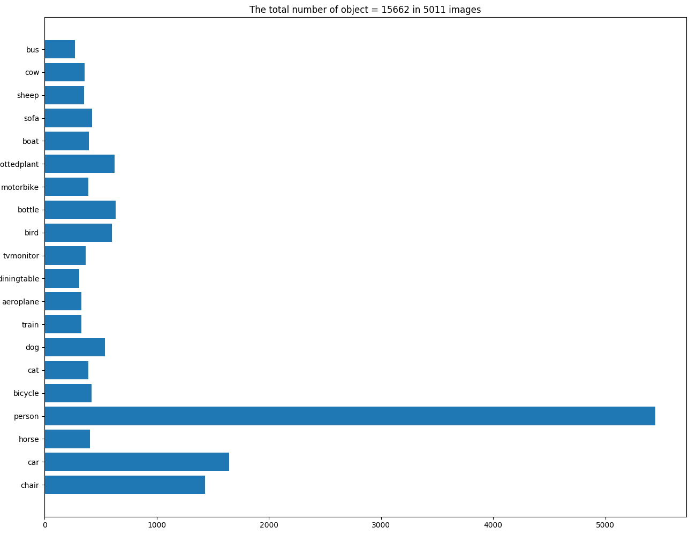
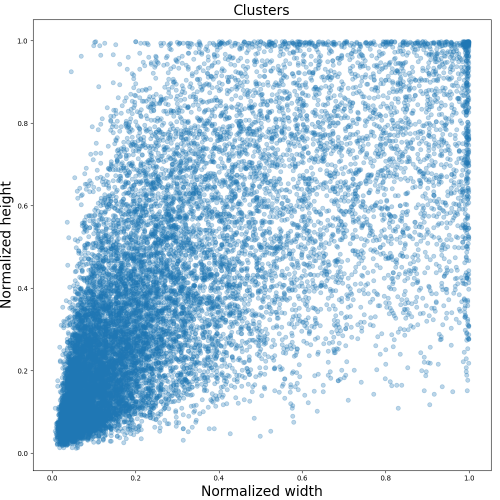
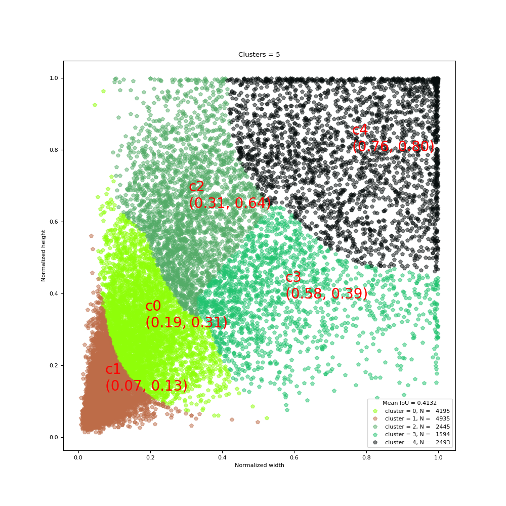

# k-means_Dimension_Cluster

## Dimension Clusters
> [YOLO9000:Better, Faster, Stronger](https://arxiv.org/abs/1612.08242)         
> **Dimension Clusters.** We encounter two issues with anchor boxes where using them with YOLO. 
> The first is that the box dimensions are hand picked. The network can learn to adjust the boxes
> appropriately but if we pick better priors for the network to start with we can make it easier
> for network to learn to predict good detections.            
> Instead of choosing priors by hand, we run k-means clustering on the training set bounding
> boxes to automatically find good priors. If we use standard k-means with Euclidean distance
> larger boxes generate more error than smaller boxes. However, what we really want are priors
> that lead to good IOU scores, which is independent of the size of the box. Thus for our 
> distance metric we use:           
> d(box, centroid) = 1 - IOU(box, centroid)
> 
> k-means algorithm 的输入数据是 ground truth bounding box 的尺寸(i.e. width and height)。
> 因为每张 image 的 size 是不同的，图片中每个 object 的 size 也是不同的，因此也不具有可比性，因此最好不要用 object 原始的 bounding
> box 的尺寸进行聚类。因此，有必要标准化 bounding box 的宽度和高度与 image 的宽度和高度。

## Intersection over Union(IoU)
### What is Intersection over Union?
* Intersection over Union (IoU) is an **evaluation metric** used to measure the accuracy of an object detector 
on a particular dataset. We often see this evaluation metric used in object detection challenges such as the 
popular [PASCAL VOC challenge](https://www.pyimagesearch.com/2016/11/07/intersection-over-union-iou-for-object-detection/)
* IoU is simply an **evaluation metric**. Any algorithm that provides predicted bounding boxes as output can be evaluated using IoU.
* In order to apply IoU to evaluate an arbitrary object detector we need:
    1. The **ground-truth bounding boxes** (i.e., the hand labeled bounding boxes from the testing set that specify where in the image our object is).
    2. The **predicted bounding boxes** from our model.
    
|   | 
|:---:| 
| *Figure 1: An example of detecting a stop sign in an image. The predicted bounding box is drawn in red while the ground-truth bounding box is drawn in green. Our goal is to compute the Intersection over Union between these bounding box.* |
* **red:** the predicted bounding box
* **blue:** ground truth bounding box

|   | 
|:---:| 
| *Figure 2: Computing the Intersection over Union is as simple as dividing the area of overlap between the bounding boxes by the area of union (thank you to the excellent Pittsburg HW4 assignment for the inspiration for this figure).* |
* Examining this equation you can see that Intersection over Union is simply a **ratio**.
  
* **An Intersection over Union score > 0.5 is normally considered a “good” prediction.**  
我们会用它来衡量两个 boundingbox 之间的距离。           
我们计算两个bounding box的iou时，只需要使用它们的4个位置参数(xmin,ymin, width, height)，这里引用别人一张图:         

|  | 
|:---:| 
| *Figure 3: Computing the Intersection over Union* |

iou的计算公式为:       

### Why do we use Intersection over Union?
In classification, we'll likely be used to *predicting class labels**, and the model outputs a single label
that is either *correct* or *incorrect*.            
This type of binary classification makes computing accuracy straightforward; however, for object detection 
it's not so simple.         
We need to define an evaluation metric that **rewards** predicted bounding boxes for heavily overlapping with the ground-truth:
对于与 ground truth boxes 大面积重叠的 predicting bounding boxes，这些 predicting bounding boxes 是预测比较好的 box。

|   | 
|:---:| 
| *Figure 4: An example of computing Intersection over Unions for various bounding boxes.* |
* As you can see, predicted bounding boxes that heavily overlap with the ground-truth bounding boxes have higher scores 
than those with less overlap. This makes Intersection over Union an excellent metric for evaluating custom object detectors.
 

## k-means clustering
### Statistic and Visualize Labels
|  |
|:---:| 
| *Figure 5: Statistic of different labels and visualize in bar.* |
* From the above figure, it shows the statistic of different classes.

### Visualize Clustering data
|  |
|:---:| 
| *Figure 6: View of clustering data.* |
* The x and y axies are normalized.
* In the left bottom corner, the density is high, which means that there have lots of points in that size region.
* There have some points in the top and right boundaries, which means that there have some objects have the same height
or width with its corresponding image. 

### k-means
K-means的聚类方法很简单，它主要包含两个步骤:

首先初始化类别数量和聚类中心:

    * Step 1: 计算每个boundingbox与所有聚类中心的距离（1-iou)，选择最近的那个聚类中心作为它的类别
    * Step 2: 使用每个类别簇的均值来作为下次迭代计算的类别中心
    
重复步骤1和2,直至每个类别的中心位置不再发生变化。

In the dataset VOC2007_Train, there has 15662 objects totally.

### Visualize Results
|  |
|:---:| 
| *Figure 7: View of k-means result with k=5.* |
* From the above figure, all objects (i.e. 15662 objects) are divided into 5 clusters, from `c0` to `c4`.
* Each cluster has a center which is also a box represented by `c` and the size of this center box is `x` and `y` axis 
of the `c`(i.e. `c1`, `c2`, ...).

### Usage [box_clustering.py](box_clustering.py)
* Run `box_clustering.py`
* The default `box_clustering.py` do k-means on training set of VOC2007. And this can be set to different dataset.

## Notes
1. This k-means just cluster all objects, therefore use equations from [Figure 3](https://farm8.staticflickr.com/7813/46412972842_6d2af063e9_h.jpg).
2. In real evaluation, the ground truth bounding box and predicted bounding box ususlly have different top left corner. 
Therefore, the equations from [Figure 3](https://farm8.staticflickr.com/7813/46412972842_6d2af063e9_h.jpg) may not usable.

## Reference:
* [tensorflow-yolov3/docs/Box-Clustering.ipynb ](https://github.com/YunYang1994/tensorflow-yolov3/blob/master/docs/Box-Clustering.ipynb)
* [codecogs](https://www.codecogs.com/latex/eqneditor.php)
* [How to show math equations in general github's markdown(not github's blog)](https://stackoverflow.com/questions/11256433/how-to-show-math-equations-in-general-githubs-markdownnot-githubs-blog)
* [Intersection over Union (IoU) for object detection](https://www.pyimagesearch.com/2016/11/07/intersection-over-union-iou-for-object-detection/)
* [Using an image caption in Markdown Jekyll](https://stackoverflow.com/questions/19331362/using-an-image-caption-in-markdown-jekyll)
